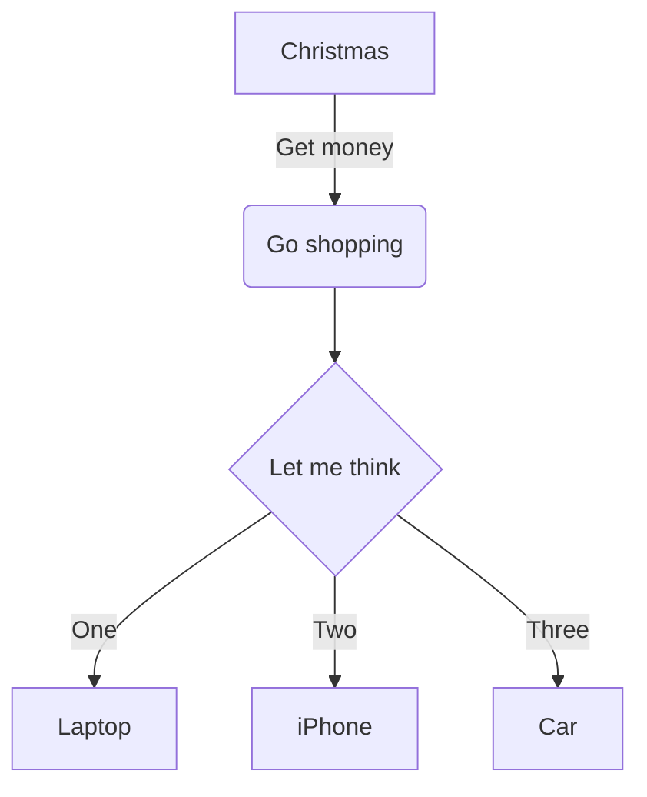

# 使用说明

## 安装插件

1. 打开谷歌浏览器，进入 `chrome://extensions/` 页面
2. 打开右上角的 "开发者模式"
3. 点击 "加载已解压的扩展程序"
4. 选择 `wechat-layout` 目录

## 基本使用

1. 打开微信公众号编辑页面
2. 点击插件图标，打开 popup 窗口
3. 在文本框中输入 Markdown 文本
4. 点击 "转换并插入" 按钮
5. 转换后的富文本将自动插入到微信公众号编辑器中

## Mermaid 图表使用

插件支持 Mermaid 图表语法，您可以在 Markdown 中使用以下语法：

````markdown

````

转换后，图表将自动渲染并插入到微信公众号编辑器中。