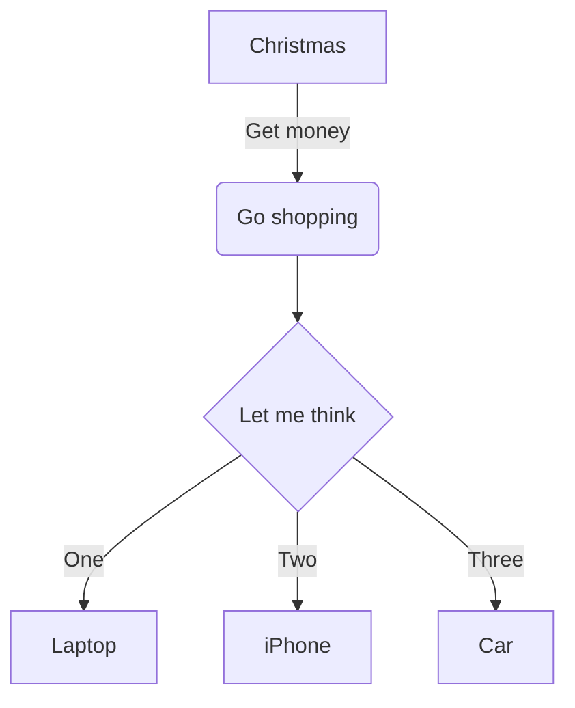

# 示例文档

这是一个示例文档，用于测试我们的 Chrome 插件。

## 普通文本

这是普通文本。

## 代码块

```javascript
console.log('Hello, world!');
```

## Mermaid 图表示例



## 列表

- 项目 1
- 项目 2
- 项目 3

## 链接

[Google](https://www.google.com)

## 强调

**加粗文本**

*斜体文本*