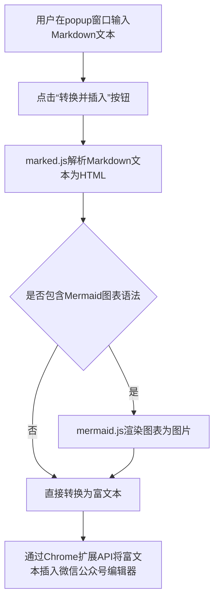
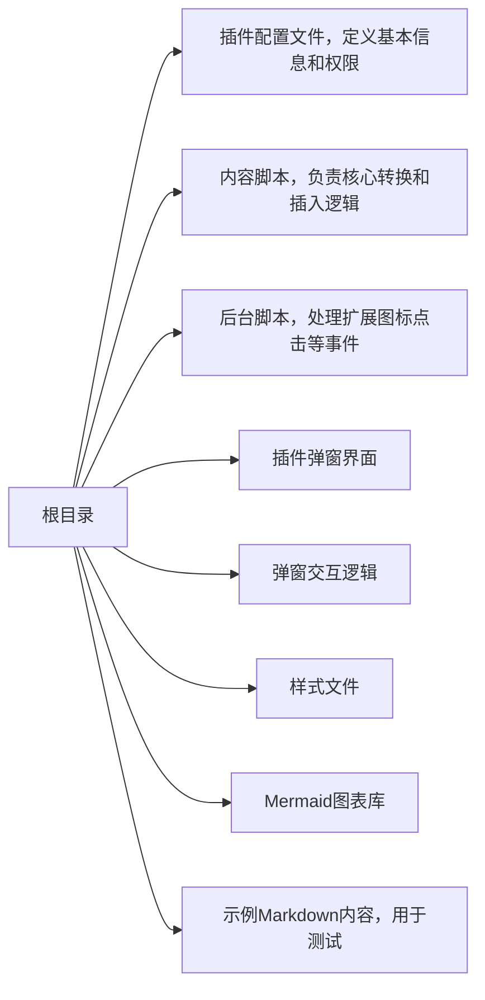

经常用Markdown写公众号的朋友，估计都被格式转换折磨过吧？明明在编辑器里排版得整整齐齐，一粘到公众号后台就乱成一锅粥——标题变普通文本、列表缩进消失、代码块更是更是糊成一团。每次都得手动调格式，费时不说还容易出错，真挺让人头大的。

为了摆脱这种麻烦，我捣鼓了个浏览器插件，用Trae 2.0开发的，能把Markdown一键转成公众号能用的格式，直接插进编辑器里，亲测好用。

### 开发工具：Trae 2.0

这次开发全靠Trae 2.0帮忙，这工具是真挺智能的。它是个带AI的IDE，最牛的是有Agent AI自动编程功能——简单说就是，我用大白话告诉它我要啥，它就能帮我搞定大部分基础工作，省了不少事。

比如我跟它说：“帮我做个谷歌浏览器插件，能把Markdown转成微信公众号的富文本，还得支持Mermaid图表，最后能自动插进编辑器里。”

没过一会儿，它就把项目基本框架搭好了，像处理转换逻辑的`content.js`、管插件图标点击的`background.js`，还有弹窗的界面和交互代码`popup.html`、`popup.js`，全都自动生成了。这下省了我从零开始写这些重复代码的功夫，能专心琢磨核心功能咋实现。

### 插件的主要功能

这插件就一个目标：让排版变简单。具体能做这几件事：

1. **Markdown转富文本**：靠`marked.js`这个库，能把`#`标题、`*`列表、代码块这些标准Markdown语法，直接转成公众号编辑器能认的格式，不用再手动改了。
2. **支持Mermaid图表**：要是文章里有流程图、甘特图这些，插件里的`mermaid.js`能识别Mermaid语法，把它转成图片再插进去，不用自己截图上传了。
3. **一键插入**：在公众号后台点开插件，粘贴内容点个按钮，排好版的文章直接就进编辑器了，基本不用再调，特省心。

### 技术实现简介

说起来复杂，其实核心就靠这几样：

- **`marked.js`**：负责把Markdown语法拆解开，转成HTML标签，这是转换的基础。
- **`mermaid.js`**：碰到Mermaid图表语法时，就靠它把代码渲染成SVG或者图片。
- **Chrome扩展API**：相当于插件和页面之间的桥梁，能让插件往公众号编辑页面里插脚本，这样才能实现获取文本、改页面内容、插东西这些操作。

整个流程大概是这样的：

### 代码仓库文件结构

仓库里的文件分工特清楚，一眼就能看出每个文件是干啥的：

### 安装与使用方法

安装和用起来都特简单，几步就搞定：

**安装步骤：**

1.  在谷歌浏览器地址栏输`chrome://extensions/`，回车。
2.  把右上角“开发者模式”打开。
3.  点“加载已解压的扩展程序”，选插件代码所在的文件夹就行。

**使用步骤：**

1.  打开微信公众号文章编辑页面，点一下浏览器工具栏上的插件图标。
2.  在弹出来的窗口里，把你的Markdown全文粘进去，或者直接在里面写。
3.  点“转换并插入”按钮，齐活。

转换完的内容直接就出现在公众号编辑器里了，格式基本没啥问题，省了好多调格式的时间。

总的来说，这个用Trae 2.0做的插件，就是为了解决用Markdown写公众号时排版麻烦的问题。如果你也经常用Markdown写公众号，试试它，说不定能帮你省不少事～

上述项目的开源地址为：[https://github.com/MouseSun846/wechat-layout.git](https://github.com/MouseSun846/wechat-layout.git)