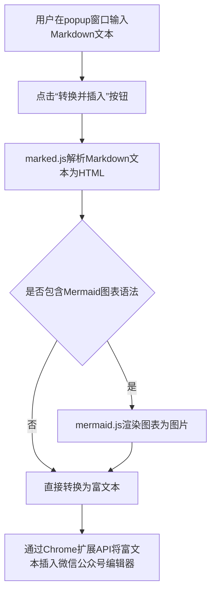
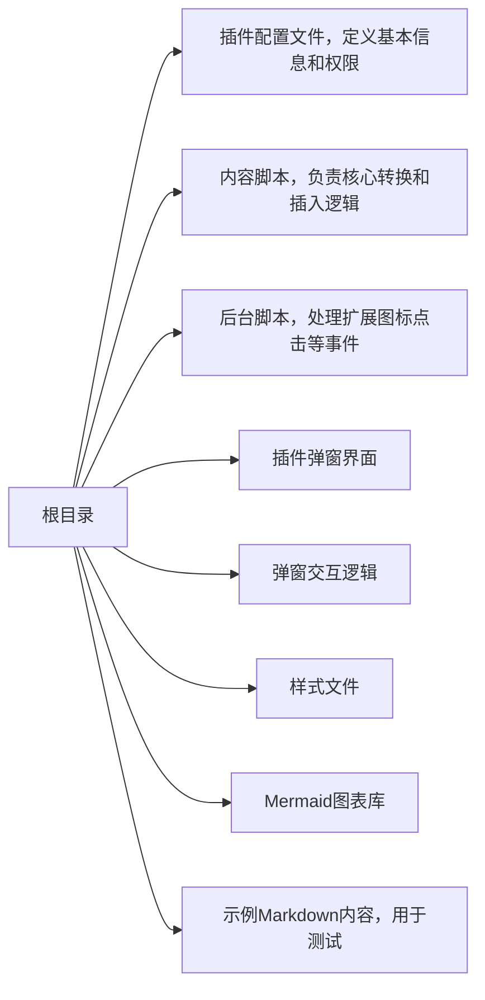

### 用 Trae 2.0，我做了个微信公众号 Markdown 排版插件

如果你经常用 Markdown 写文章，再发布到微信公众号，那一定对格式转换的繁琐深有体会。手动调整标题、列表和代码块，不仅费时，还容易出错。为了解决这个问题，我用 Trae 2.0 开发了一款浏览器插件，可以把 Markdown 一键转换并插入到公众号编辑器里。

#### 开发工具：Trae 2.0

这次开发我用了一个新工具——Trae 2.0。它是一个集成了 AI 的 IDE，特点是具备 Agent AI 自动编程能力。简单说，就是我用自然语言描述需求，它能帮我完成大部分基础工作。

比如，我向 Trae 2.0 提出需求：“创建一个谷歌浏览器插件，能将 Markdown 转为微信公众号的富文本格式，要支持 Mermaid 图表，并自动插入到编辑器。”

随后，它就自动生成了项目的基本框架，包括：

  * `content.js`：处理 Markdown 转换和页面内容插入的核心逻辑。
  * `background.js`：处理插件图标点击等后台事件。
  * `popup.html` 和 `popup.js`：插件的弹窗界面和交互。

这个过程省去了大量项目初始化的重复劳动，让我可以更专注于核心功能的实现。

#### 插件的主要功能

这款插件的核心目标很明确，就是简化排版流程。它主要有以下几个功能：

1.  **Markdown 转富文本**：利用 `marked.js` 库，将标准的 Markdown 语法，如 `#` 标题、`*` 列表、代码块等，直接转换为公众号编辑器兼容的格式。
2.  **支持 Mermaid 图表**：如果你需要在文章里插入流程图、甘特图等，插件也集成了 `mermaid.js`。它能识别 Mermaid 语法块，并将其渲染成图片，再插入文章中。
3.  **一键插入**：在公众号后台，打开插件窗口，粘贴内容，点击按钮，排版好的文章就自动进入编辑器了，基本不需要二次修改。

#### 技术实现简介

插件的技术实现主要依赖几个关键部分：

  * **`marked.js`**：负责解析 Markdown 语法，将其转换为 HTML 标签。这是整个转换过程的基础。
  * **`mermaid.js`**：当检测到 Mermaid 语法时，调用这个库将其渲染成 SVG 或图片。
  * **Chrome 扩展 API**：这是插件与页面交互的桥梁。通过它向微信公众号编辑页面注入 `content.js` 脚本，从而实现获取文本、操作 DOM、插入内容等功能。

插件的工作流程如下：

#### 代码仓库文件结构

仓库文件结构如下，每个文件职责分明：

#### 安装与使用方法

安装和使用都很简单：

**安装步骤：**

1.  在谷歌浏览器地址栏输入 `chrome://extensions/`。
2.  打开右上角的“开发者模式”。
3.  点击“加载已解压的扩展程序”，选择插件代码所在的文件夹即可。

**使用步骤：**

1.  在微信公众号文章编辑页面，点击浏览器工具栏的插件图标。
2.  在弹出的窗口中，输入或粘贴你的 Markdown 全文。
3.  点击“转换并插入”按钮。

转换后的内容就会自动出现在公众号编辑器里，格式基本完美。

总的来说，这款基于 Trae 2.0 开发的插件，主要解决了 Markdown 内容在微信公众号平台排版不便的问题。如果你也用 Markdown 为公众号写作，它应该能帮你节省不少时间。